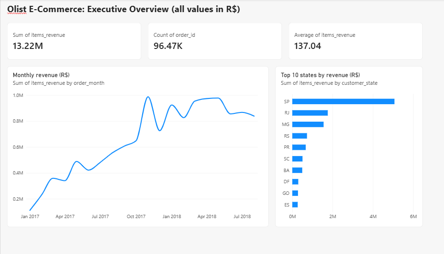
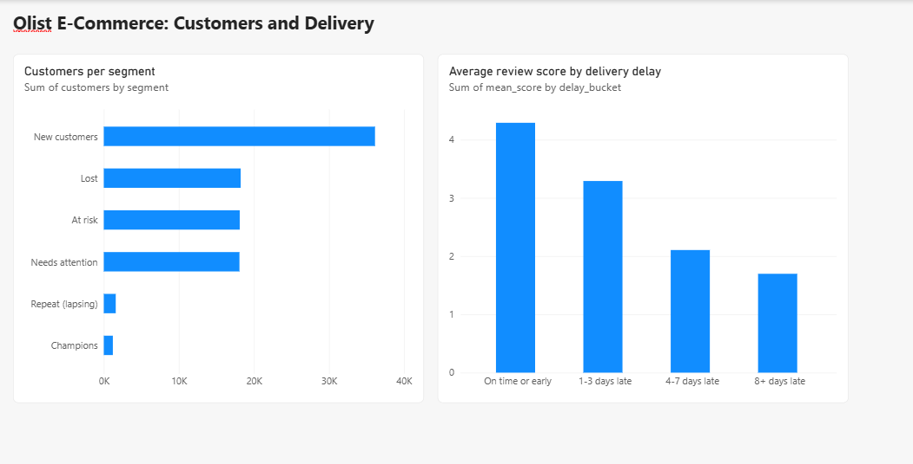

# Olist E-Commerce Revenue and Customer Retention Analysis

This is my data analyst portfolio project. I analysed an online marketplace from Brazil (Olist) to understand **why so few customers buy a second time**, and whether **late deliveries** are one of the reasons.

I used SQL for the business questions, Python for cleaning and deeper analysis, and Power BI for the dashboard.

## Business problem

> The marketplace is bringing in many orders, but customers do not come back. Which parts of the business bring the revenue, where do customers get unhappy, and what can be improved?

I tried to answer these questions:
- How big is the business and how did it grow over time?
- Which product categories, sellers and states bring most of the revenue?
- Where are deliveries slow or late?
- Do late deliveries lower the review score?
- How many customers buy again?

## Dataset

[Brazilian E-Commerce Public Dataset by Olist](https://www.kaggle.com/datasets/olistbr/brazilian-ecommerce) from Kaggle.
- About 100,000 orders from Sep 2016 to Aug 2018
- 9 related tables (orders, customers, items, payments, reviews, products, sellers, category names, geolocation)
- All money values are in Brazilian reais (R$)

The raw CSV files are not in this repository. You can download them from Kaggle and put them in a `data/` folder.

## Tools used

| Purpose | Tool |
|---|---|
| Database | MariaDB 10.4 (XAMPP) with phpMyAdmin |
| Analysis | SQL, Python 3.14 (pandas, numpy, matplotlib, seaborn, scipy, SQLAlchemy) |
| Notebook | Jupyter in VS Code |
| Dashboard | Power BI Desktop |
| Version control | Git and GitHub |

## How I did the project

1. **Loaded the data.** I created the 9 tables in MariaDB first, then loaded the CSV files with Python (`notebooks/00_load_data.ipynb`). I checked that the row counts match the original files.
2. **Wrote 10 SQL queries** to answer business questions, using joins, CTEs and window functions (`sql/02_analysis_queries.sql`).
3. **Built one SQL view** with one row per order (`sql/03_create_analysis_view.sql`). I summed items, payments and reviews to one row per order first, so that joining does not repeat orders. The view has 99,441 rows, same as the orders table.
4. **Cleaned and analysed the data in Python** (`notebooks/01_cleaning_rfm_cohort_stats.ipynb`): data cleaning, customer groups (RFM), cohort retention, and a statistical test for late delivery vs review score.
5. **Built a Power BI dashboard** with the main results.
6. **Wrote my findings** for every step in `docs/insights.md`.

## Key findings

- **Size of the business:** 96,478 delivered orders from 93,358 customers, R$13.22M revenue, average order value R$137.
- **Growth:** Revenue grew very fast in 2017 (highest month: Nov 2017, R$987,765) but stayed almost flat from March 2018.
- **Where the money comes from:** SP alone brings 38.3% of revenue, and SP, RJ and MG together bring 63.4%. 18 product categories make 80% of revenue.
- **Customers do not come back:** Only 3.00% of customers ordered more than once. On average only 0.47% came back in the month after their first order.
- **Repeat customers are worth more:** They spend about double per customer (R$250 to R$270 vs R$130 to R$141).
- **Late delivery hurts reviews:** 6.8% of orders were late. Late orders have an average review of 2.27, on-time orders 4.29 (Mann-Whitney U test, p < 0.001). For orders more than 8 days late, 79% got 1 or 2 stars.
- **Revenue at risk:** R$618,573 (4.7% of revenue) comes from orders that were late and got a 1 or 2 star review.

The full explanation of each result is in [`docs/insights.md`](docs/insights.md).

## Recommendations

1. Improve delivery in the states with the most late orders: AL (21.4% late), MA (17.4%), SE (15.2%) and RJ (12.1% late, and it is the second biggest market).
2. Send an offer to first-time buyers so that they order a second time, because repeat customers spend about double.
3. Look at shipping cost in the northern states. Freight is 24% to 26% of the product price there, against 14% in SP.

## Dashboard

**Page 1: Executive overview**



**Page 2: Customers and delivery**



The Power BI file is in the `dashboard/` folder.

## Project structure

```
olist-ecommerce-analysis/
├── sql/
│   ├── 01_create_tables.sql
│   ├── 02_analysis_queries.sql
│   └── 03_create_analysis_view.sql
├── notebooks/
│   ├── 00_load_data.ipynb
│   └── 01_cleaning_rfm_cohort_stats.ipynb
├── dashboard/        (Power BI file)
├── docs/             (insights and screenshots)
├── data/             (not uploaded, download from Kaggle)
└── README.md
```

## How to run it

1. Download the dataset from Kaggle and put the CSV files in a `data/` folder.
2. Start MySQL/MariaDB (I used XAMPP) and run `sql/01_create_tables.sql` in phpMyAdmin.
3. Install the libraries: `pip install pandas numpy matplotlib seaborn scipy statsmodels sqlalchemy pymysql`
4. Run `notebooks/00_load_data.ipynb` to load the CSV files into the database. Change the path in the notebook to your own folder.
5. Run `sql/03_create_analysis_view.sql`, then `sql/02_analysis_queries.sql` query by query.
6. Run `notebooks/01_cleaning_rfm_cohort_stats.ipynb`.

## Problems I faced and what I learned

- **Customer count:** `customer_id` changes with every order, so I used `customer_unique_id` to count real customers.
- **Late delivery mistake:** My first query counted orders delivered on the promised day as late, because the estimated date has no time. I found it when checking rows in the view and fixed it by comparing only dates. Late orders went from 7,661 down to 6,381.
- **Duplicate rows:** Joining items, payments and reviews directly can repeat an order many times, so I summed each table to one row per order first.
- **Data loading:** phpMyAdmin guesses column types when importing CSV files, so I created the tables myself and loaded the data with Python.

## Limitations

- There is no cost or profit data, so this project is about revenue, not profit.
- The data only covers Sep 2016 to Aug 2018, and the first months have very few orders.
- The customer groups (RFM) depend on how I split the scores, so another split would give different group sizes.
- Revenue at risk is an estimate, not money that is already lost.

---
Made by Madhuri Thoke
